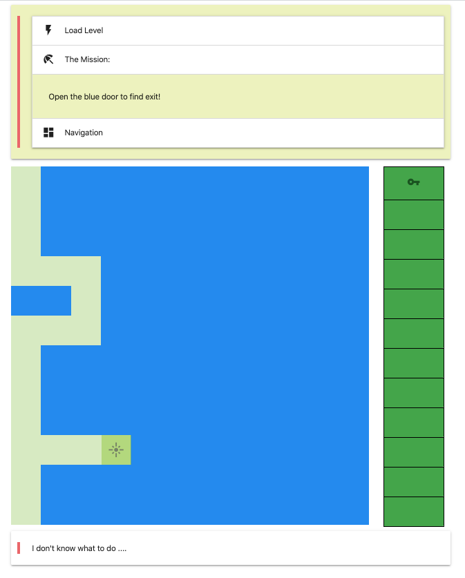

<center>Welcome to the Picker Game</center>


#### Table of Contents

- [Motivation](#motivation)
- [Getting Started](#getting-started)
- [Gemeplay](#gameplay)
- [Building Levels](#building-levels)
- [Types of map objects](#types-of-map-objects)
- [Adding new level](#adding-new-level)
- [TODO](#todo)

#### Motivation

---

The game is a simple Board Game based on js, html, css, react, parcel.

The motivation was ot develop a board game with flexible extendability (adding new levels, adding new objects, adding new behavior).

#### Getting Started

---

First, fork the repository. Then, go into your terminal

```terminal
git clone git@github.com:YOUR_USERNAME/picker-game.git
cd picker-game
yarn install
yarn dev
```

> > yarn dev will start the development server and watch for changes on the client-side code

Now you may visit <code>http://localhost:1234</code> to start playing!

#### Gameplay

- <span>&#8592;</span> - step to the left
- <span>&#8594;</span> - step to the right
- <span>&#8593;</span> - step up
- <span>&#8595;</span> - step down
- <span>alt</span> - observe the cell
- <span>enter</span> - open the door
- <span>space</span> - pick an object

> > TO WIN YOU SHOULD FIND AND OPEN A BLUE DOOR!

On the right panel you can see your BACKPACK.

> > When you pick any object it will appear in a backpack stack on a screen!
> > When you use (for example a key) it will dissapear from the backpack and will be pulled from the stack!

#### Building Levels

Levels based on scaffold array

```javascript
[
  [
    "level_zero", // map hash
    [
      // map scaffold
      [VISITED, 0, WALL, 0],
      [0, WALL, 0, DOORS.BLUE_DOOR],
      [0, WALL, 0, 0],
      [0, 0, 0, KEYS.BLUE_KEY],
    ],
    4, // size of the map
    "Mission description", // mission description
  ],
];
```

> > In this version there are only 3 types of keys and doors (blue, red, green)!

> > If you want to extend existing level list, just add your array into the [levels.js](https://github.com/yacheckalin/picker-game/blob/master/levels.js)

---

#### Types of map objects

- KEYS.RED_KEY - a key from red door
- KEYS.BLUE_KEY - a blue key (key from exit)
- KEYS.GREEN_KEY - a key from green door
- WALL - wall
- VISITED - visited (already discovered) cells (you can walk through them)
- DOORS.RED_DOOR - a red door
- DOORS.GREEN_DOOR - a green door
- DOORS.BLUE_DOOR - the exit door

#### Adding new level

> > If you put the DOOR (any but BLUE) on a map, it should be surrounded by <code>WALL || WALL_D</code> with one entry cell.

```javascript
[
  [0, 0, 0, 0],
  [0, 0, 0, 0],
  [0, 0, 0, DOORS.RED_DOOR],
  [0, 0, 0, 0],
];
```

or

```javascript
[
  [0, 0, 0, 0],
  [0, 0, 0, WALL],
  [0, 0, 0, DOORS.RED_DOOR],
  [0, 0, 0, WALL],
];
```

or

```javascript
[
  [0, WALL, 0, 0],
  [0, WALL, 0, 0],
  [0, DOORS.RED_DOOR, WALL_D, 0], // means that you can walk to the right through the door
  [0, WALL, 0, 0],
];
```

> > When you 'open' the door, all <code>WALL_D</code> cells will be marked as <code>VISITED</code>.

#### TODO

This topic describes future updates which still in progress

- add score counting (time, number of steps, backpack elements, etc ...)
- add new entities (like bomb with timer)
- add graphical editor for building levels (drag-and-drop)
- add 'save the results' for storing data
