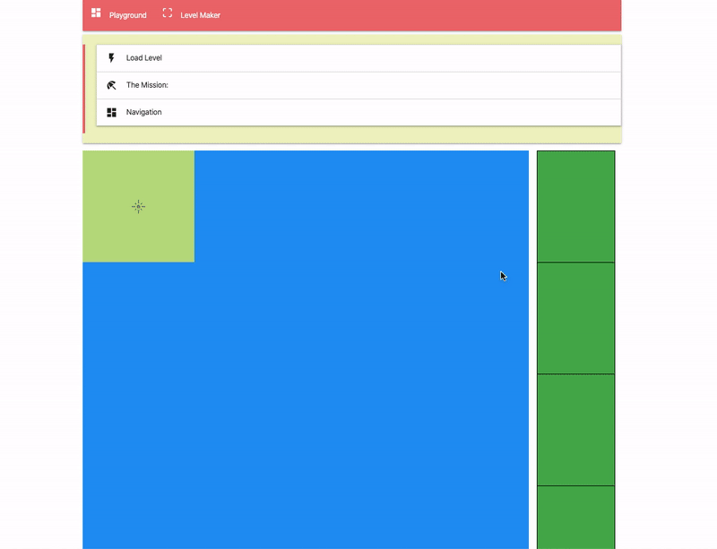

<p>
  

</p>

#### Table of Contents

- [Level Maker Motivation](#motivation)
- [Getting Started](#getting-started)
- [How to build your level](#how-to-build-your-level)
- [Validation rules](#validation-rules)

#### Motivation

Create level building tool with GUI.

#### Getting Started

This tool is a part of the Picker-Game, so you don't need any extra installation.

```javascript
yarn install
yarn dev
```

And it will be richable on '/level-maker' route.

```javascript
http://localhost:1234/level-maker
```

> > All generated levels will be accessible from the <code>Load Level</code>list on a <code>Playground</code> page.

or

```javascript
http://localhost:1234/play
```

#### How to build your level

- pointer click - select the cell

> > You can select several cells before action!

- Enter - open <code>Toolbar Menu</code> with items

> > When you select more than one cell, you can put only <code>WALL | WALL_D </code> type of objects

> > If you click on <code>Save</code> button, the map will be validated and saved to the <strong>localStorage</strong>

#### Validation rules

- each map should have an <strong>Exit</strong> <i>[BLUE_DOOR]</i>
- each map should have at least one <strong><i>BLUE_KEY</i></strong>
- each map should have <strong><i>LEVEL_HASH</i></strong>
- each map should have description for <strong><i>LEVEL_MISSION</i></strong>
- map size can't be less than <strong>MIN_MAP_SIZE -> [3]</strong>
- map size can't be greater than <strong>MAX_MAP_SIZE -> [50]</strong>
- each <b>DOOR</b> should have at least one <b>KEY</b>
